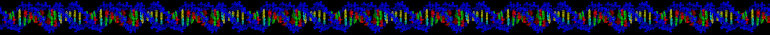

&nbsp;  

My mother built bombers during WWII. My dad flew as a radio operator in the Pacific war. They returned to hide in their tiny Midwestern town and have a family. Yes, I'm a "boomer". Dad signed on at the local cement plant as an hourly worker, while mom minded the house and said the "happiest time of her life was working in the bomber plant." Their idyll was short lived - when I was two years and nine months old mom was overcome by the tuberculosis we both caught from her father, and she nearly died in the state hospital. But she came back after twenty months and lived a long life. She built most of the 50+ feet of concrete and stone wall along the driveway, ruled family finances with an iron fist, and corrected my father and me at the first hint of chauvinism. 

The balance to my controlling feminist mother was provided by the aunt and uncle I lived with while she was in the TB hospital, and the family farm they ran together. Without that perspective I'd probably be a raging fascist instead of eternally curious. 

My aunt tended the garden, canned dozens of jars of vegetables for winter, maintained the cream separator and made butter, cared for and processed the chickens, and occasionally taught one-room country school. My uncle drove tractors, baled hay, welded broken equipment, tended the cattle and hogs, dealt with the ax and chopping block when it was time to process chickens, and taught me by example the curiosity and patience to deal with nature and technology. 

It sounds horribly gendered, but compared to my life in town it was blessed freedom. There were no arbitrary rules, no negative judgments. If you knew how to do something you were free to put on the appropriate clothes for the task and go do it. What gender you felt or were supposed to feel just never came up. 

Back with my parents, I felt less secure. I was a "sensitive" kid, not in today's sense of tantrums and meltdowns, emotional overload, but in noticing subtle details of adult life and thinking deeply about their meanings. The "fly story" was my parents' favorite, though they completely misinterpreted my reaction: 

I'd followed my dad to the bathroom to check the indoor-outdoor thermometer beside the window, because if it wasn't above 70 degrees I was not allowed to go outside. (Of course when school started I had to walk there no matter how far below zero it was...) Dad swatted a fly on the window with his bare hand, picked it up, tossed it in the open toilet, and immediately flushed. It was not the killing that bothered me, I saw animals killed all the time. It was being treated like shit, flushed and forgotten, irretrievably extinguished in an instant with no apparent concern at all. I felt extremely vulnerable and cried inconsolably. Who was this man I was now bound to? Could I be zapped away as suddenly and totally? 

